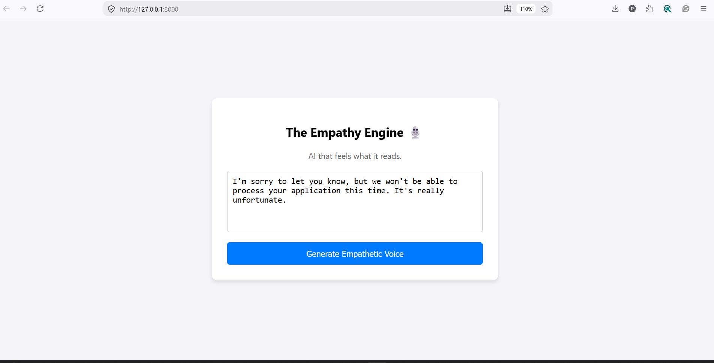

# The Empathy Engine 🎙️

## 1. Project Description
"The Empathy Engine" is an AI-powered text-to-speech (TTS) web service designed to eliminate the "uncanny valley" of robotic AI voices. It takes text input, analyzes its emotional sentiment using a pre-trained NLP model, and dynamically modulates the vocal parameters of the generated audio to match the detected emotion. This bridges the gap between text-based sentiment and human-like expressive audio.

## 2. Setup Instructions
Follow these steps to run the application locally:

**Prerequisites:** Python 3.8+ installed on your system.

1. **Clone the repository:**
   Download or clone this repository to your local machine.

2. **Install Dependencies:**
   Open your terminal in the project directory and run:
   `pip install -r requirements.txt`

3. **Set up API Key:**
   - Create a free account on [ElevenLabs](https://elevenlabs.io/) and get your API key.
   - Open `main.py` and replace `"YOUR_ELEVENLABS_API_KEY_HERE"` with your actual API key.

4. **Run the Application:**
   Execute the following command in your terminal:
   `uvicorn main:app --reload`

5. **Access the UI:**
   Open your web browser and go to `http://127.0.0.1:8000`

## 3. Design Choices & Emotion-to-Voice Mapping Logic
* **Emotion Detection:** I used the `j-hartmann/emotion-english-distilroberta-base` model via Hugging Face. Instead of basic Positive/Negative sentiment, it provides granular emotions (Joy, Anger, Sadness, Fear, etc.), fulfilling the **Bonus Objective**.
* **Backend Framework:** Built using **FastAPI** for fast, asynchronous API handling and a seamless web UI integration.
* **TTS Engine:** I utilized the **ElevenLabs API** as it provides state-of-the-art expressive voices, far superior to standard offline TTS engines.
* **Vocal Parameter Modulation (The Mapping Logic):**
  Instead of simple pitch/rate changes, I dynamically modulated the `stability` and `style` parameters of the ElevenLabs voice engine based on the emotion:
  * **Joy/Surprise:** Low Stability (0.3), High Style (0.6) -> Highly expressive, dynamic pitch shifts, and enthusiastic delivery.
  * **Sadness:** Moderate Stability (0.4), Low Style (0.4) -> Flatter pitch, slower delivery, more monotone to reflect sorrow.
  * **Anger:** Very Low Stability (0.25), High Style (0.7) -> Erratic pitch changes, intense and sharp delivery mimicking frustration.
  * **Default/Neutral:** High Stability (0.75), Zero Style (0.0) -> Clear, standard professional reading.

## 4. Usage Examples (Test Cases)
To see the engine in action, try pasting these examples into the web UI:
* **Frustration:** *"I am so incredibly frustrated with this service! I have been waiting on hold for two hours!"*
* **Joy:** *"Oh my goodness, I just got the email! I got the job! This is the best news ever!"*
* **Sadness:** *"I'm sorry to let you know, but we won't be able to process your application this time. It's really unfortunate."*